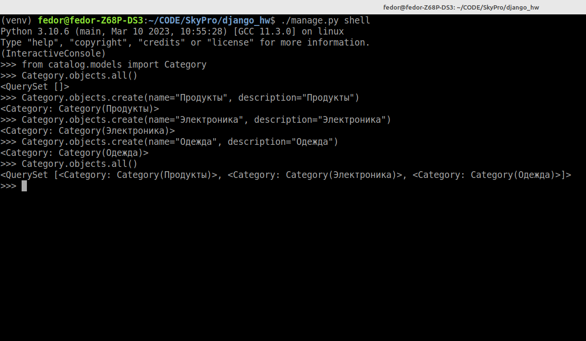

# Домашнее задание по теме 20.1 "Работа с ORM в Django"

### Задание 6
Через инструмент shell заполните список категорий,
а также выберите список категорий,
применив произвольные рассмотренные фильтры.
В качестве решения приложите скриншот.

Скриншот:
